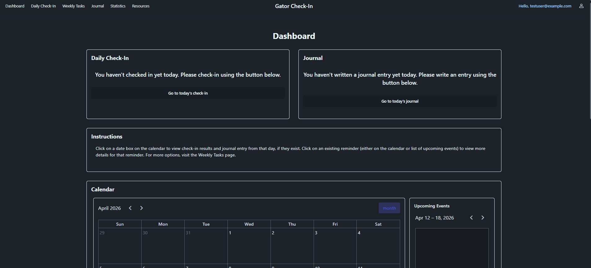
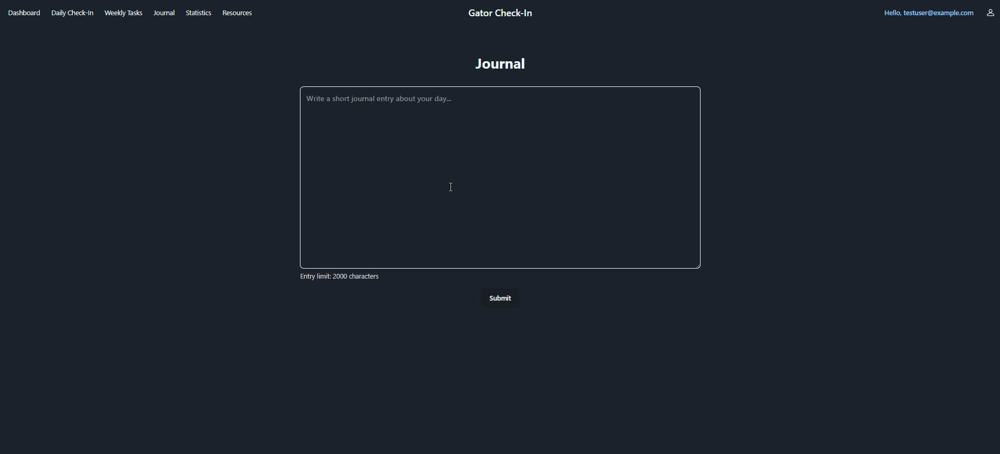
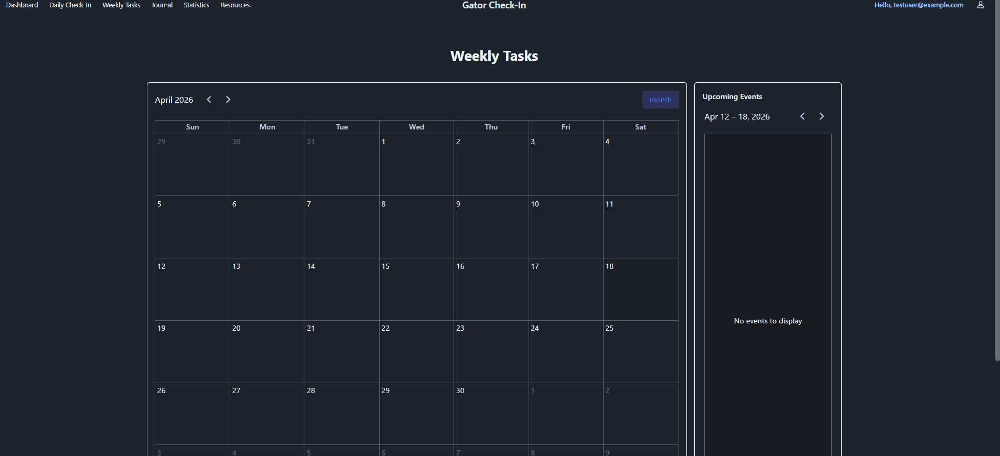

# Gator Check-In

## Table Of Contents
0. [Overview](#overview)
1. [Core Features](#core-features)
2. [Tech Stack](#tech-stack)
3. [Getting Started](#getting-started)
4. [Usage/Examples](#usageexamples)
5. [Documentation](#documentation)
6. [Authors](#authors)

## Overview
---
Gator Check-In is a simple wellness tracking web application. The app gives users a easy way to log daily wellness data, write journal entries, manage weekly tasks and events, and review recent trends through a local web interface.

## Core Features
---
- **User Authentication:** register and log in with a stored account
- **Daily Check-Ins:** record mood, stress, energy, and sleep data
- **Journal Entries:** write a journal entry tied to the current day's check-in
- **Weekly Goals/Tasks:** create and manage tasks and events through the calendar system
- **Statistics/Trends:** view weekly averages and seven-day wellness history
- **Calendar Management:** create, edit, and organize events and recurring items
- **Resources Page:** access wellness-related support resources

## Tech Stack
---
- **Backend:** Python, Flask
- **Database:** SQLite, SQLAlchemy, Flask-Migrate
- **Authentication:** JWT, Werkzeug password hashing
- **Frontend:** HTML, JavaScript, Tailwind CSS, DaisyUI, Flowbite, FlyonUI
- **Data Visualization / UI Libraries:** ApexCharts, FullCalendar, Flatpickr
- **Testing:** Pytest
- **Package Management:** pip, npm

## Getting Started
### 1. Initial Setup
* **Clone the repository:** Clone or download this project into VS Code.
* **Open the project folder:** Make sure you are inside the project root folder (`.../wellness-check-in`).
* **Install prerequisites:** Ensure both **Python** and **Node.js** are installed on your machine before running the launcher script.

### 2. Start the Application
* **Run the batch file:** Use the provided launcher script from the project root.
  ```powershell
  .\start_app.bat
  ```
* **Alternative:** You can also double-click `start_app.bat` in File Explorer.

### 3. What the Script Does
* **Creates/uses the virtual environment** for the project
* **Installs Python dependencies** from `requirements.txt`
* **Installs Node packages** from `package.json`
* **Builds the Tailwind CSS output** needed by the frontend
* **Starts the Flask web app** for local use

### 4. Open the Website
* **Navigate to the app:** If the browser does not open automatically, paste the following into your browser:
  ```text
  http://127.0.0.1:5000
  ```

### 5. Notes
* First launch may take longer because dependencies may need to be installed.
* If the batch file closes immediately, run it through PowerShell or Command Prompt to view any error messages.

## Usage/Examples
---
- **Register/Login:** Create an account or sign in to an existing account.
- **Daily Check-In:** Submit mood, stress, energy, and sleep values for the current day.

- **Journal Page:** Add a journal entry after completing the current day's check-in.

- **Weekly Tasks / Calendar:** Create events, recurring events, and task items.

- **Statistics Page:** Review weekly averages and recent check-in history.
- **Resources Page:** View wellness-related support resources included in the app.

## Documentation
---
- **Backend code:** `checkin_backend/app`
- **Frontend input styling:** `src/input.css`
- **Compiled CSS output:** `checkin_backend/app/static/css/output.css`
- **Templates:** `checkin_backend/app/templates`
- **Tests:** `tests`

- [Documentation](linkplaceholder)
- [Video Overview](linkplaceholder)

## Authors
---
- [@Colbygrimmscott](https://github.com/Colbygrimmscott)
- [@Jorodon](https://github.com/Jorodon)
- [@Kroselli](https://github.com/Kroselli)
- [@keylaperez](https://github.com/keylaperez)
